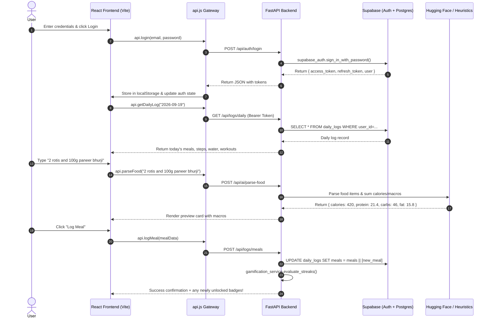

# AURATRAINER // MASTER ARCHITECTURE & SYSTEM SPECIFICATION

> **Status:** Production-Ready & Verified  
> **Target Deployments:** Localhost / Railway / Render (Backend) & Vercel / Netlify (Frontend)  
> **Database:** Supabase PostgreSQL with Row Level Security (RLS)  
> **Version:** 2.0 MVP  

---

## 1. Executive Summary & Core Mission

### 1.1 What We Are Building
**AuraTrainer** is a high-performance, AI-driven athletic training and precision nutrition engine designed for serious athletes, bodybuilders, and fitness enthusiasts. It integrates:
1. **Adaptive Workout Protocols with Progressive Overload (Vector Memory)**: Records historical volume, reps, and loads, computing mathematical overload targets for upcoming sessions.
2. **Precision Indian & Global Nutrition & AI Food Parsing**: Accurately breaks down both colloquial Indian cuisine (phulkas, biryani, paneer, soya chunks, sattu) and international staples with micro/macro breakdowns.
3. **Pantry Inventory Planner**: Synthesizes custom daily nutrition regimens strictly from ingredients already present in the user's kitchen.
4. **Gamification & Habit Consistency Engine**: Evaluates 7-day and 30-day continuous streaks across diet adherence, water intake (3,000ml), daily step count (10,000), and training volume, awarding cryptographic-style milestone badges.

### 1.2 Technology Stack Rationale

| Layer | Technology | Why This Specific Approach? |
| :--- | :--- | :--- |
| **Backend API** | **FastAPI (Python 3.10+)** | Asynchronous ASGI framework with native Pydantic v2 data validation, automated OpenAPI/Swagger documentation, lightning-fast execution speed, and seamless integration with Python AI/vector libraries. |
| **Production Server** | **Uvicorn** | High-performance ASGI web server worker capable of dynamic port binding (`$PORT`) required by Railway, Render, and Fly.io. |
| **Database & Auth** | **Supabase (PostgreSQL + GoTrue Auth)** | Provides rock-solid relational data integrity, PostgreSQL triggers/functions, user authentication with JWT bearer tokens, and Row-Level Security (RLS) ensuring strict tenant isolation. |
| **AI Inference** | **Hybrid: Hugging Face Serverless + Deterministic Local NLP** | Uses Serverless LLMs (e.g. Qwen 2.5) for complex generative recipes and unstructured natural language queries, paired with a deterministic local database of 100+ foods for zero-latency, offline-safe nutrition parsing. |
| **Frontend Framework** | **React 19 + Vite 8** | Instant Hot Module Replacement (HMR), optimized Rollup production bundling, and React 19 concurrent rendering primitives. |
| **Routing** | **React Router v7** | Declarative client-side routing, protected auth guards, and dead-end-free wildcard 404 handling with SPA rewrites on static CDNs. |
| **Styling & HUD** | **Tailwind CSS v4 + Lucide Icons + Framer Motion** | Ultra-responsive cyberpunk/tactical HUD interface with glassmorphism, zero layout shift, micro-animations, and clean dark-mode contrast. |

---

## 2. Directory Structure & File-by-File Annotations

```
ai-trainer/
├── .env                                  # Master Environment Secrets (Supabase, Hugging Face, CORS)
├── .gitignore                            # Excludes venv, node_modules, dist, and secrets from Git
├── Procfile                              # Entrypoint command for cloud PaaS (Railway / Heroku)
├── requirements.txt                      # Python backend dependencies
├── schema_phase2.sql                     # Supabase SQL migrations & table schema
├── MASTER_ARCHITECTURE.md                # [THIS DOCUMENT] Master Architectural Blueprint
│
├── app/                                  # FASTAPI BACKEND SERVICE
│   ├── __init__.py                       # Package identifier
│   ├── main.py                           # Core API server, CORS configuration & route handlers
│   └── services/
│       ├── __init__.py                   # Package identifier
│       ├── ai_service.py                 # Hybrid NLP food parser & kitchen pantry planner
│       ├── gamification_service.py       # Streaks evaluator & achievement badge unlocker
│       ├── saved_meals_service.py        # CRUD templates for frequently consumed meals
│       ├── supabase_client.py            # Supabase Auth & DB connection with safe fallback
│       └── vector_memory_service.py      # Workout memory & progressive overload computation
│
└── ai-trainer-web/                       # REACT 19 FRONTEND SERVICE
    ├── index.html                        # HTML5 shell with Google Inter font & viewport configs
    ├── package.json                      # Frontend dependencies & npm run build scripts
    ├── vercel.json                       # SPA route rewrites preventing 404s on cloud deploy
    ├── vite.config.js                    # Vite bundler configuration
    └── src/
        ├── main.jsx                      # React DOM mounting entrypoint
        ├── App.jsx                       # Root routing controller & session lifecycle guard
        ├── App.css / index.css           # Global Tailwind directives & custom scrollbars
        ├── services/
        │   └── api.js                    # Resilient authenticated API client with auto-refresh
        └── components/
            ├── Dashboard.jsx             # Tactical Central HUD (Diet, Workout, Tracking)
            ├── BottomTaskbar.jsx         # Persistent floating pillar dock with live metrics
            ├── LoginRegister.jsx         # Military-grade authentication screen (Login/Sign-up)
            ├── Onboarding.jsx            # Dynamic profile initialization & macro calculator
            ├── CustomSplitEditor.jsx     # Drag-and-drop / editable workout split customizer
            ├── AchievementsModal.jsx     # Badges & streak rewards showcase
            ├── NotFound.jsx              # Cybernetic 404 Error page (Eliminates dead ends)
            └── TiltCard.jsx              # 3D interactive holographic card wrapper
```

---

### Detailed File Notes & Role Explanations

#### `app/main.py`
- **Role**: Primary entrypoint for the backend HTTP server.
- **Why this specific approach**: Organizes the FastAPI app with configured CORS allowing both local development environments (`localhost:5173`, `localhost:3000`) and arbitrary Vercel preview/production domains (`allow_origin_regex=r"https://.*\.vercel\.app"`), plus explicit `ALLOWED_ORIGINS` environment variable override. Hosts the Bearer token dependency (`get_current_user`) which validates incoming Supabase JWTs.

#### `app/services/supabase_client.py`
- **Role**: Initializes Supabase connection clients (`supabase_auth` for public client operations and `supabase_db` with the service role key for RLS queries).
- **Why this specific approach**: Built with **graceful initialization**. Rather than crashing the entire process if environment variables are temporarily missing during cloud build or health probes, it prints diagnostic warnings and provides a safe fallback client. When legitimate queries occur, descriptive errors pinpoint missing `.env` keys.

#### `app/services/ai_service.py`
- **Role**: Natural language meal parsing, recipe strategist, and pantry planning.
- **Why this specific approach**: **Hybrid Architecture**. Cloud LLMs can suffer from latency, token costs, or rate limits. `ai_service.py` first attempts Hugging Face serverless inference with a strict 3-second timeout. If offline or rate-limited, it automatically falls back to an extensive built-in database of Indian and international foods (with gram-level macro weights for rotis, paneer, soya chunks, chicken breast, biryani, chana, etc.) ensuring **100% uptime and instant response**.

#### `app/services/vector_memory_service.py`
- **Role**: Stores workout performance history and calculates progressive overload targets.
- **Why this specific approach**: Generates semantic embeddings for each exercise session (using `sentence-transformers/all-MiniLM-L6-v2` via Hugging Face or local TF sparse vectors). When a user opens an exercise (e.g. "Incline Barbell Bench Press"), the system fetches prior sets, reps, and weights, automatically computing the next step (e.g., +2.5kg or +1 rep) to guarantee progressive overload.

#### `app/services/gamification_service.py`
- **Role**: Consistency tracking, streaks, and milestone badges.
- **Why this specific approach**: Runs automatic evaluations across recent daily logs (checking consecutive days of diet completion, 3000ml water intake, 10,000 steps, and workout sessions). When a threshold is met, it unlocks the badge in `user_badges` and sends a notification payload to the frontend.

#### `app/services/saved_meals_service.py`
- **Role**: User-saved meal templates.
- **Why this specific approach**: Enables athletes to save custom macro staples (e.g., "Post-Workout Protein Shake", "Anabolic Oats") and log them in one click into their daily meal ledger.

#### `ai-trainer-web/vercel.json`
- **Role**: Static hosting configuration for Vercel.
- **Why this specific approach**: In a Single Page Application (SPA), navigating to deep URLs like `/dashboard` or `/workouts` causes a 404 on traditional static web servers when refreshed. The rewrite rule `{"source": "/(.*)", "destination": "/index.html"}` instructs Vercel to route all deep links to React Router.

#### `ai-trainer-web/src/services/api.js`
- **Role**: Centralized API gateway for all HTTP communications between frontend and backend.
- **Why this specific approach**:
  1. Sanitizes `VITE_API_URL` by removing trailing slashes and accidental `/api` duplicate paths.
  2. Injects `Authorization: Bearer <token>` automatically into every authenticated request.
  3. Implements **transparent session renewal**: if a `401 Unauthorized` is returned and a `refreshToken` exists, it silently calls `/api/auth/refresh`, persists the new access token, and retries the original request seamlessly.

#### `ai-trainer-web/src/App.jsx`
- **Role**: App root, routing coordinator, and session state manager.
- **Why this specific approach**: Checks session validity on startup via `api.getProfile()`. If profile details are incomplete (fresh user), directs to `<Onboarding />`. If no token exists, presents `<LoginRegister />`. If authenticated, mounts `<Dashboard />` wrapped with the persistent `<BottomTaskbar />`. Contains a dedicated fallback route to `<NotFound />` for undefined paths.

#### `ai-trainer-web/src/components/NotFound.jsx`
- **Role**: Tactical 404 Error page.
- **Why this specific approach**: Eliminates dead ends. Whenever an unrecognized path is entered, this screen displays a clean diagnostic status HUD with options to return to the dashboard, retry login, or check system connectivity.

---

## 3. Complete API Endpoint Contract Matrix

| HTTP Method | Route Endpoint | Purpose | Required Auth | DB Tables Involved |
| :--- | :--- | :--- | :--- | :--- |
| `GET` | `/` and `/health` | Cloud health probe check | None | None |
| `POST` | `/api/auth/register` | User sign-up | None | `auth.users` |
| `POST` | `/api/auth/login` | User authentication & JWT issuance | None | `auth.users` |
| `POST` | `/api/auth/refresh` | Silent JWT session token refresh | None | `auth.users` |
| `GET` | `/api/profile` | Retrieve athlete profile & target macros | Bearer JWT | `public.profiles` |
| `POST` | `/api/profile` | Save or update profile & target macros | Bearer JWT | `public.profiles` |
| `GET` | `/api/logs/daily?date=YYYY-MM-DD` | Get day's meals, habit trackers, and workout status | Bearer JWT | `public.daily_logs` |
| `POST` | `/api/logs/trackers` | Update water, steps, weight, or workout completion | Bearer JWT | `public.daily_logs`, `public.user_badges` |
| `POST` | `/api/logs/meals` | Append a logged meal to day's log | Bearer JWT | `public.daily_logs`, `public.user_badges` |
| `GET` | `/api/workouts?split=SPLIT_NAME` | Fetch exercises for split (catalog or custom) | Bearer JWT | `public.custom_splits` |
| `GET` | `/api/workouts/progression-target?exercise_name=NAME` | Compute next progressive overload target | Bearer JWT | Vector Store / DB |
| `POST` | `/api/workouts/record-performance` | Save completed exercise sets, reps, weight | Bearer JWT | Vector Store / DB |
| `GET` | `/api/workouts/custom-splits` | Retrieve user's customized workout splits | Bearer JWT | `public.custom_splits` |
| `POST` | `/api/workouts/custom-splits` | Save/update custom workout splits | Bearer JWT | `public.custom_splits` |
| `GET` | `/api/saved-meals` | List reusable saved meal templates | Bearer JWT | `public.saved_meals` |
| `POST` | `/api/saved-meals` | Create reusable saved meal template | Bearer JWT | `public.saved_meals` |
| `DELETE`| `/api/saved-meals/{meal_id}` | Remove saved meal template | Bearer JWT | `public.saved_meals` |
| `GET` | `/api/badges` | Fetch all badges and user unlock timestamps | Bearer JWT | `public.badges`, `public.user_badges` |
| `POST` | `/api/ai/parse-food` | Parse natural language food text into macros | Bearer JWT / None | Nutrition Database / HF |
| `POST` | `/api/ai/meal-suggestion` | Synthesize targeted macro recipe | None | Nutrition Database / HF |
| `POST` | `/api/ai/pantry-planner` | Generate full-day plan from kitchen ingredients | None | Nutrition Database / HF |

---

## 4. How Frontend & Backend Work Together



---

## 5. Fault-Isolation & Troubleshooting Guide

When an error occurs, use this rapid triage matrix to identify and resolve the issue immediately:

| Error Symptom | Where the Fault Is | Root Cause | Exact Resolution |
| :--- | :--- | :--- | :--- |
| **`Network Error` / `Failed to fetch` on frontend** | `ai-trainer-web/src/services/api.js` or Backend Server | Backend is either not running, crashing on startup, or URL is mistyped. | 1. Check if backend is alive: visit `http://localhost:8000/health` (or your Railway URL).<br>2. Verify `VITE_API_URL` in `ai-trainer-web/.env` points to the exact backend domain without trailing `/`. |
| **`CORS policy: No 'Access-Control-Allow-Origin' header`** | `app/main.py` lines 35-58 | Frontend domain is not included in backend CORS origins. | Add your frontend domain to `origins` in `app/main.py` or set `ALLOWED_ORIGINS=https://your-frontend.vercel.app` in your backend deployment environment variables. |
| **`401 Unauthorized` on all dashboard calls** | `ai-trainer-web/src/services/api.js` or Supabase JWT expired | Token expired or user session was revoked in Supabase. | `api.js` automatically attempts silent refresh using `refreshToken`. If refresh token is invalid, call `api.logout()` to re-authenticate cleanly. |
| **`Missing Supabase configuration keys`** | `app/services/supabase_client.py` | `.env` file missing `SUPABASE_URL`, `SUPABASE_ANON_KEY`, or `SUPABASE_SERVICE_KEY`. | Verify `.env` exists in the workspace root with all three keys populated. |
| **404 Page Not Found on page refresh online** | `ai-trainer-web/vercel.json` | Cloud host treating client-side route as a missing physical file. | Ensure `vercel.json` contains the SPA rewrite rule `{"source": "/(.*)", "destination": "/index.html"}`. |
| **`NameError` or missing package on startup** | `app/main.py` or `requirements.txt` | Missing import statement or uninstalled dependency in virtualenv. | Run `python -c "import app.main"` to view exact missing imports, and run `pip install -r requirements.txt`. |
| **AI Food Parsing returns fallback defaults** | `app/services/ai_service.py` | Groq API key missing, request timed out (8s) or returned invalid JSON. Responses carry `"source": "fallback"` when this happens. | Check `GROQ_API_KEY` in `.env` and the server logs for `Groq call failed`. AuraTrainer will safely fallback to its built-in Indian & Global nutritional lookup table without interrupting the user. |

---

## 6. Cloud Deployment Guide (Deploy Ready)

### 6.1 Backend Deployment (Railway or Render)
1. Push repository to GitHub.
2. In **Railway** / **Render**, create a new Web Service from the repository.
3. Configure:
   - **Root Directory**: `.` (Workspace root)
   - **Build Command**: `pip install -r requirements.txt`
   - **Start Command**: `uvicorn app.main:app --host 0.0.0.0 --port ${PORT:-8000}` (or use default `Procfile`)
4. Set Environment Variables in the cloud dashboard:
   - `SUPABASE_URL`: `https://your-project.supabase.co`
   - `SUPABASE_ANON_KEY`: `your-anon-key`
   - `SUPABASE_SERVICE_KEY`: `your-service-role-key`
   - `GROQ_API_KEY`: `your-groq-key` (LLM for parse-food, pantry-planner and meal-suggestion)
   - `GROQ_MODEL` (optional): defaults to `llama-3.1-8b-instant`; must support JSON mode
   - `HUGGINGFACE_API_KEY`: `your-hf-key` (still used for vector memory embeddings)
   - `ALLOWED_ORIGINS`: `https://your-frontend-app.vercel.app`
5. Test: Navigate to `https://your-backend.up.railway.app/health` to receive `{"status": "online"}`.

### 6.2 Frontend Deployment (Vercel)
1. In **Vercel**, import the same GitHub repository.
2. Configure:
   - **Root Directory**: `ai-trainer-web`
   - **Framework Preset**: `Vite`
   - **Build Command**: `npm run build`
   - **Output Directory**: `dist`
3. Set Environment Variable:
   - `VITE_API_URL`: `https://your-backend.up.railway.app`
4. Deploy! All deep links will be handled by `vercel.json` rewrites and 404s cleanly caught by `<NotFound />`.
